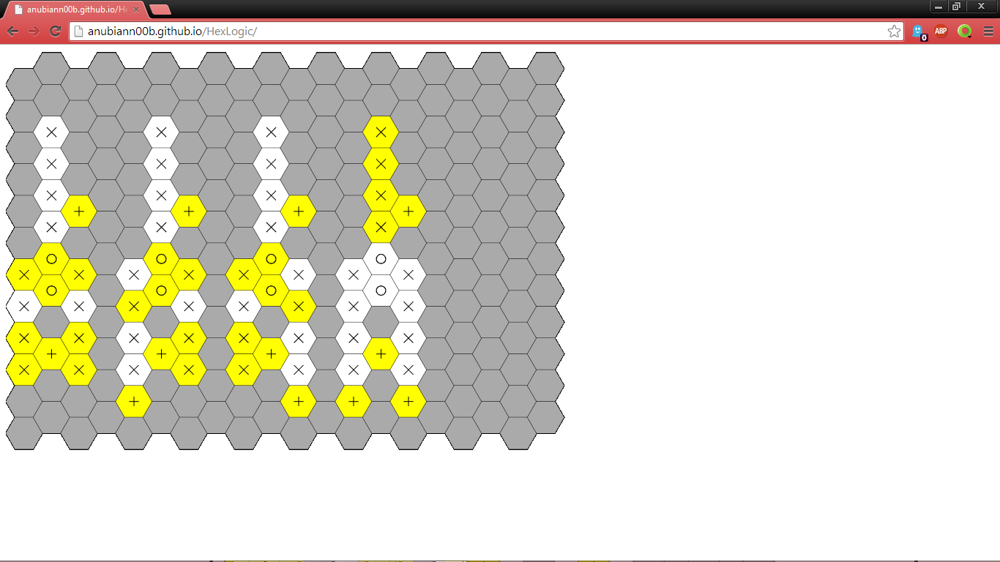

HexLogic
========

A clone of [LogicHex](https://mojang.com/notch/logichex/) by [Notch](https://mojang.com/notch/) (yes, the guy who made Minecraft) using Javascript canvas. Try it out: http://anubiann00b.github.io/HexLogic/

Here are some examples of what you can make:

Switch direction:

AND gate:

Multiplexer:

Adder:

Adder that's more chainable:

